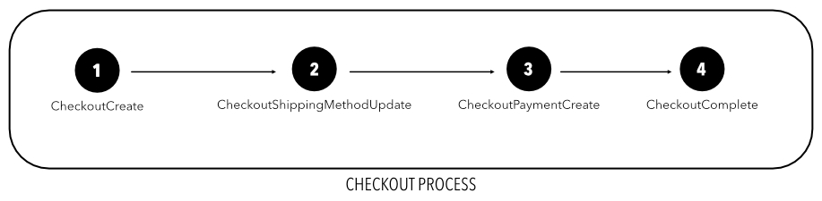
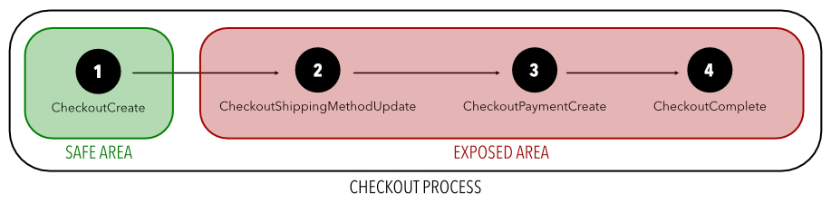

# Ubiquitous Testing - Story telling
Un ubiquitous test è un test parametrico che può essere istanziato su un sistema software sia con dati concreti, generati a tempo di sviluppo e prima del rilascio, sia con dati collezionati dal campo durante l'esecuzione del software.
Esso consente di definire un nuovo paradigma di generazione dei test che supera i limiti dei test concreti, sfruttando la generalizzabilità garantità dai test parametrici e property-based.

Si consideri per esempio il seguente blocco di codice che definisce una classe ```Vehicle``` e i suoi metodi, nel contesto di un programma che permette di simulare scenari di traffico urbano con SUMO, un popolare simulatore di traffico, e TraCI, una libreria che permette l'implementazione di interazioni con il simulatore, per esempio inserendo o rimuovendo veicoli all'interno dell'ambiente di simulazione, ed eseguendo comandi di spostamento.

```python
class Vehicle:
    def __init__(self, id, current_coordinates, current_edge, route):
        self.id = id
        self.current_coordinates = current_coordinates
        self.current_edge = current_edge
        self.route = route

    def update_vehicle_position():
        x,y = traci.vehicle.getPosition(self.id)
        self.current_coordinates = traci.simulation.convertGeo(x,y)
        current_edge,_,_ = traci.simulation.convertRoad(x,y)
        self.current_edge = current_edge

    def generate_new_route(destination_coordinates):
        x,y = destination_coordinates
        destination_edge = traci.simulation.convertRoad(x,y,fromGeo=True)
        route = traci.simulation.findRoute(self.current_edge, destination_edge)
        self.route = route
```

Durante la simulazione, i veicoli presenti nello scenario seguono percorsi (route) definiti come liste di identificativi di strade da percorre (edges) da una sorgente a una destinazione (esempio: ```['-4891757#1', '-4891757#0', '-4577392#4', '-4577392#3', '-4577392#2']```).

Il metodo ```update_vehicle position``` richiede le coordinate cartesiane del veicolo in un determinato istante di tempo, converte le coordinate cartesiane in coordinate geografiche (salvandole nell'attributo ```current_coordinates``` dell'istanza di classe), e trasforma le coordinate nel corrispondente edge (salvando l'identificativo nell'attributo ```current_edge``` dell'istanza di classe).

Il metodo ```generate_new_route``` definisce un nuovo percorso per il veicolo. Date in input le coordinate di destinazione in formato geografico (```destination_coordinates```), esse vengono convertite nel corrispondente edge. Il metodo ```findRoute``` della libreria TraCI, infine, genera una nuova route per il veicolo.

Data la specifica del metodo ```convertRoad```, esso ritorna l'identificativo della strada percorsa in un determinato istante da un veicolo, definita la sua posizione nello spazio.

Si consideri ora un esempio di **test concreto** definito per verificare la correttezza del metodo ```generate_new_route``` e un corrispondente **ubiquitous_test**.

```python
# TEST CONCRETO
def test_generate_new_route():
    # PREFIX
    vehicle_coordinates = (8.61701, 47.75130579999998)
    current_edge = "-4577392#4"
    route = ['-4892557#1', '-4891757#0', '-4577392#4', '-4577392#3', '-4577392#2']
    vehicle = Vehicle("car_0", vehicle_coordinates, current_edge, route)
    destination_coordinates = (8.17115, 47.624590)
    destination_edge = '-4577522#0'

    # METHOD CALL
    vehicle.generate_new_route(destination_coordinates)
    
    # POSTCONDITIONS
    assert vehicle.current_edge == current_edge
    assert vehicle.route == ['-4577392#4', '-4577392#3',...,'-4577522#0']


# UBIQUITOUS TEST
def test_generate_new_route(data):
    # PREFIX
    data = json.load(data)  # deserialization
    vehicle = data["vehicle"]
    current_edge = vehicle.current_edge
    destination_coordinates = data["destination_coordinates"]
    sumo_net = data["sumo_net"]
    destination_edge = traci.simulation.convertRoad(destination_coordinates[0], destination_coordinates[1], fromGeo=True)

    # PRECONDITIONS
    assume Map.is_sumo_edge(destination_edge)

    # METHOD CALL
    vehicle.generate_new_route(destination_coordinates)

    # POSTCONDITIONS
    assert vehicle.current_edge == current_edge
    assert len(vehicle.route) > 0
    assert vehicle.route[0] == vehicle.current_edge
    assert vehicle.route[-1] == destination_edge
    for i in range(len(vehicle.route)):
        edge = vehicle.route[i]
        # check the type of the edge
        assert type(edge) == str
        # check is a valid edge
        assert Map.is_sumo_edge(edge)
        # check the route is connected
        if i < len(vehicle.route) - 1
            next_edge = vehicle_route[i+1]
            assert type(next_edge) == str
            assert Map.is_sumo_edge(next_edge)
            outgoing_edges = list(map(lambda e: e.getID(), edge.getOutgoing())
            assert next_edge in outgoing_edged
        assert 


    
class Map:
    @staticmethod
    def is_sumo_edge(sumo_net, id):
        return id in list(map(lambda e: e.getID(), sumo_net.getEdges()))
```

Come è possibile osservare, il test concreto è un test che si basa su dati specifici e verifica la corretta esecuzione di un metodo sulla base del singolo input con cui il test viene sollecitato.

L'ubiquitous test è invece un test che generalizza il comportamento del test, sfruttando un approccio property-based che consente di verificare che il metodo non violi le prioprietà che devono essere garantite prima e dopo l'esecuzione del metodo under test. L'ubiquitous test è un test che può essere istanziato con qualsiasi input, preso dal campo o definito a tempo di sviluppo, che rispetti le precondizioni definite. Il test concreto può pertanto essere riprodotto dall'ubiquitous test. 

I test concreti che verificano il corretto funzionamento del metodo considerano un esiguo sottoinsieme dell'infinito insieme delle coordinate. Inoltre, i due metodi, seppur scorrelati, sono tra loro dipendenti poiché il metodo ```generate_new_route``` utilizza l'attributo ```current_edge```, che viene ridefinito ad ogni chiamata del metodo ```update_vehicle_position```. Gli attributi non definiti, ma utilizzati nei metodi under test sono genericamente sostituiti con mock o generati in modo corretto (non sono parte del test, come l'input al metodo). 

La specificità del test concreto non garantisce comunque la correttezza del metodo con altri input, soprattutto in casi complessi come questo dove il risultato non é una singola variabile, ma una struttura dati più complessa.

In quanto a costo di produzione, l’obiquitous test è certamente più prolisso, ma la differenza di codice è comunque dello stesso ordine di grandezza.

L’ubiquitous test, inoltre limita la fase di prefix alla deserializzazione degli oggetti raccolti dal campo e la riproduzione dello stato globale e ambientale del sistema. Il test concreto richiede invece l’istanziazione di tutti i componenti necessari all’esecuzione del test.

Infine, l’utilizzo dei mock up è drasticamente ridotto nell’ubiquitous test.

In termini di postcondizioni, la qualità dell'ubiquitous test è paragonabile a quella del test concreto. Nell'esempio considerato, il test non può verificare ogni elemento delle liste prodotte, ma esso non è nemmeno lo scopo del metodo da testare. Lo scopo è la generazione di una nuova route a partire da delle coordinate di destinazione. La definizione di  proprietà è il modo più efficace per astrarre e generalizzare le caratteristiche dei metodi e verificarne la correttezza.

Le limitazioni del test concreto espongono il metodo ```generate_new_route``` a una failure difficilmente catturabile a tempo di sviluppo. Il fallimento si verifica in **particolari condizioni**, che si possono verificare casualmente durante la simulazione. Infatti, le reti stradali della simulazione sono caratterizzate da ```edge``` e ```internal_edge``` (o ```junction```). Gli edge sono strade regolari, mentre gli ```internal_edge``` rappresentano le giunzioni tra due edge. Nel caso particolare in cui un veicolo attraversi un internal edge nel momento in cui viene chiamato il metodo ```update_vehicle_position```, l'attributo ```current_edge``` viene settato con un valore lecito (un identificativo in formato stringa), ma non accettato come input dal metodo ```findRoute``` della libreria TraCI.

I due metodi sono temporalmente indipendenti e possono essere chiamati in fasi diverse della simulazione. Pertanto, il trigger di un field test eseguito collezionando il dato sul campo potrebbe essere in grado di rivelare l'errore prima che esso si trasformi in una failure. Analizzando a posteriori il modo in cui vengono generati gli identificativi degli ```edge``` e degli ```internal_edge``` è infatti possibile notare un pattern diverso: i primi preseentano la seguente struttura ```[A-Za-Z0-9]+#[0-9]```, mentre i secondi presentano unformato diverso, come il seguente ```:[A-Za-Z0-9]+_[0-9]```.
Un sistema di monitoraggio basato sulle grammatiche potrebbe quindi essere in grado di discernere le due diverse tipologie di stringhe, caratterizzate da caratteri speciali differenti e individuare la seconda stringa come anomala e potenzialmente pericolosa per il sistema (triggerando i corrispondenti field test e rivelando lo stato corrotto prima che si verifichi un failure).


Si consideri un secondo esempio significativo: il processo di checkout di una popolare piattaforma di e-commerce open-source, [Saleor](https://github.com/saleor/saleor). 
Il processo di checkout è implementato mediante un pattern wizard composto da 4 steps, ognuno dei quali invoca una specifica funzionalità del sistema, al fine di completare un ordine a partire da un carrello di prodotti.



Il primo step (CheckoutCreate) triggera un metodo che acquisisce le informazioni relative al carrello, il destinatario, l'indirizzo di spedizione e l'indirizzo di fatturazione. In questa fase del processo di checkout, la logica del sistema esegue tutti i check per verificare che i prodotti aggiunti nel carrello siano disponibili in stock e autorizzati alla vendita.
Nel secondo e nel terzo step, l'utente seleziona un metodo di spedizione e di pagamento, rispettivamente. Il processo di checkout termina con un quarto step, dove l'utente conferma l'ordine.
Infine, la logica del processo di checkout implementa un sistema di salvataggio così che l'utente che ha già completato una o più fasi e abbandona temporaneamente il processo può riprenderlo dallo step che aveva interrotto.

Il processo di checkout è stato implementato correttamente, secondo le specifiche, e tutti i test concreti progettati per verificare la correttezza dei singoli step del processo (sia nelle condizioni normali che in quelle eccezionali) passano.

Tuttavia, i test eseguiti *in-house* non sono in grado di rivelare un fault che si verifica quando un'inedita sequenza di eventi permette di generare un ordine, anche se un prodotto presente nel carrello non è autorizzato alla vendita.

Infatti, ogni prodotto nel carrello è un'istanza di una classe Product con un attributo booleano che certifica se è disponibile per la vendita. Gli amministratori del sistema possono modificare il valore di questa variabile booleana per ogni prodotto a catalogo, in qualsiasi momento. Tuttavia, il sistema verifica la disponibilità del prodotto solo nella prima fase del processo di checkout.



Pertanto, possiamo identificare un'area sicura e un'area esposta nel processo di pagamento. Se la modifica sulla disponibilità alla vendita viene eseguita su un prodotto nel carrello quando l'utente non ha ancora superato il primo passaggio, il sistema blocca l'utente nel completamento della procedura di checkout. Al contrario, se l'utente ha già superato il primo passaggio della procedura, può completare l'ordine anche se il prodotto non è più disponibile per la vendita.
Il fatto che il sistema memorizzi lo stato del processo di checkout quando l'utente torna al catalogo o esce dall'applicazione aumenta la possibilità che l'utente possa completare un ordine in futuro, anche se un prodotto nel carrello non è più disponibile per la vendita.

Si consideri ora il test concreto che verifica la seconda fase di checkout (**CheckoutShippingMethodUpdate**), quando l'utente seleziona il metodo di spedizione desiderato.

L'esempio è tratto da un test case concreto trovato nel progetto open source [Saleor](https://github.com/saleor/saleor). Saleor è implementato in Django (un popolare framework Web Python) e GraphQL (un linguaggio di query per le API rilasciato da Facebook e alternativo all'API REST per accedere, manipolare e consumare dati). Per generare test concreti, gli sviluppatori hanno utilizzato **PyTest** un framework di test per Python.

```python
    @pytest.mark.parametrize("is_valid_shipping_method", (True, False))
    @patch("saleor.graphql.checkout.mutations.clean_shipping_method")
    def test_checkout_shipping_method_update(
        mock_clean_shipping,
        staff_api_client,
        shipping_method,
        checkout_with_item,
        is_valid_shipping_method,
    ):
        checkout = checkout_with_item
        query = MUTATION_UPDATE_SHIPPING_METHOD
        mock_clean_shipping.return_value = is_valid_shipping_method

        checkout_id = graphene.Node.to_global_id("Checkout", checkout.pk)
        method_id = graphene.Node.to_global_id("ShippingMethod", shipping_method.id)

        response = staff_api_client.post_graphql(
            query, {"checkoutId": checkout_id, "shippingMethodId": method_id}
        )
        data = get_graphql_content(response)["data"]["checkoutShippingMethodUpdate"]

        checkout.refresh_from_db()

        mock_clean_shipping.assert_called_once_with(
            checkout=checkout, lines=list(checkout), method=shipping_method, discounts=ANY
        )

        if is_valid_shipping_method:
            assert not data["errors"]
            assert data["checkout"]["id"] == checkout_id
            assert checkout.shipping_method == shipping_method
        else:
            assert data["errors"] == [
                {
                    "field": "shippingMethod",
                    "message": "This shipping method is not applicable.",
                }
            ]
            assert checkout.shipping_method is None
```

A prima vista, potrebbe sembrare che il test sia singolo ma in realtà il blocco di codice esegue il test due volte, considerando la variabile booleana *is_valid_shipping_method* sia come **True** che **False**.

```python
    def test_checkout_shipping_method_update(
        mock_clean_shipping,
        staff_api_client,
        shipping_method,
        checkout_with_item,
        is_valid_shipping_method,
    ):
        checkout = checkout_with_item
        query = MUTATION_UPDATE_SHIPPING_METHOD
        mock_clean_shipping.return_value = is_valid_shipping_method

        checkout_id = graphene.Node.to_global_id("Checkout", checkout.pk)
        method_id = graphene.Node.to_global_id("ShippingMethod", shipping_method.id)
```

La prima riga del test contiene la definizione e l'invocazione degli oggetti simulati utilizzati all'interno del test. Le righe di codice seguenti rappresentano il prefix del test in cui gli oggetti, i modelli e la query sono configurati in base al comportamento che il tester desidera verificare.

Queste operazioni sono necessarie, ma riducono la leggibilità dei test. Inoltre, diversi test che eseguono gli stessi metodi condividono quasi tutto il prefix perché utilizzano gli stessi oggetti e modelli, con solo valori diversi di alcune proprietà. Pertanto, il codice nei test concreti è solitamente ridondante.


```python
    response = staff_api_client.post_graphql(
        query, {"checkoutId": checkout_id, "shippingMethodId": method_id}
    )
    data = get_graphql_content(response)["data"]["checkoutShippingMethodUpdate"]
```

La parte centrale del test concreto è destinata all'esecuzione del metodo under test. Nel caso specifico il metodo viene invocato tramite una query GraphQL (mutazione). La query prende come parametri le informazioni generate nel prefix del test. Il risultato del metodo chiamato è memorizzato nella variabile *data*.


```python
    mock_clean_shipping.assert_called_once_with(
        checkout=checkout, lines=list(checkout), method=shipping_method, discounts=ANY
    )

    if is_valid_shipping_method:
        assert not data["errors"]
        assert data["checkout"]["id"] == checkout_id
        assert checkout.shipping_method == shipping_method
    else:
        assert data["errors"] == [
            {
                "field": "shippingMethod",
                "message": "This shipping method is not applicable.",
            }
        ]
        assert checkout.shipping_method is None
```

La condizione if-else nel frammento di codice sopra individua quale blocco di asserzioni deve essere eseguito, rispetto al valore della variabile booleana *is_valid_shipping_method*. Nella prima esecuzione il valore è **True** e il test esegue le asserzioni nel blocco di codice if, mentre nella seconda esecuzione il valore è **False** e il test verifica le asserzioni nel blocco di codice else.

**I test concreti sono accurati in termini di asserzioni, ma mancano in termini di generizzabilità. Verificano che una condizione specifica sia valida per l'input specifico del metodo in prova. Tuttavia questo approccio non garantisce che il metodo in prova soddisfi una proprietà indipendentemente dall'input ricevuto.**

L'esempio riportato di test case concreto non è in grado di rivelare il bug nel processo di checkout.

Un esempio di ubiquitous test in grado di testare lo stesso metodo sia con input concreti che sul campo, è il seguente.

```python
@pytest.mark.django_db
def test_checkout_shipping_method_update(
    info
):
    # PREFIX
    info = json.loads(info)
    user = User.objects.get(email=info["email"])
    user_field_api_client = ApiClient(user=user)
    variables = {
        "param_0": info["checkoutId"],
        "param_1": info["shippingMethod"]
    }
    
    # PRECONDITIONS
    assume Checkout.objects.exists()

    # METHOD CALL
    response = user_field_api_client.post_graphql(
        MUTATION_UPDATE_SHIPPING_METHOD, {"checkoutId": checkout_id, "shippingMethodId": shipping_method_id}
    )
    data = get_graphql_content(response)["data"]["checkoutShippingMethodUpdate"]

    checkout.refresh_from_db()

    # POSTCONDITIONS
    if len(data["errors"]) == 0:
        assert not data["errors"]
        assert data["checkout"]["id"] == checkout_id
        assert checkout.shipping_method == shipping_method
    else:
        assert data["errors"] == [
            {
                "field": "shippingMethod",
                "message": "This shipping method is not applicable.",
            }
        ]
        assert checkout.shipping_method is None
```

Nel caso in esame il test concreto presente nel codice non è in grado di rilevare l’errore per due motivi: (i) non testa il metodo con un input in grado di rilevarlo, e anche nel caso in cui si definisse lo stesso test con un input in grado di rilevarlo (ii) il test non presenta le asserzioni in grado di verificare che la proprietà di disponibilità del prodotto sia ancora valida dopo l’esecuzione del metodo. Il secondo punto può essere risolto con l’introduzione di specifiche asserzioni che verificano la validità della proprietà, mediante un approccio property-based. 

```python
    for checkout_line in list(checkout.lines.all()):
        product = checkout_line.variant.product
        assert product.is_available_for_purchase()
```

Questo punto non rende l’ubiquitous test di per sé migliore di un test concreto. Tuttavia, anche aggiungendo l’asserzione mancante, il test concreto non è in grado di rilevare il fault perché non è presente un input in grado di rivelarlo (punto i, senza soluzione). Al contrario, semplicemente aggiungendo le asserzioni corrette, l'ubiquitous test è potenzialmente in grado di rilevare l'errore, poiché non dipende da un input specifico. 

Il successo dell'ubiquitous test dipende solo dalla qualità del sistema di monitoraggio e di attivazione del trigger, che consente di catturare ed eseguire il test su un dato anomalo, rilevando l'inconsistenza.

Il monitoraggio dei dati prodotti e usati a tempo di esecuzione può essere diretto o indiretto: nel caso diretto è possibile osservare il valore anomalo per triggerare un ubiquitous test. È per esempio il caso delle grammatiche, che utilizzano macchine a stati finiti per capire quando una stringa presenta dei caratteri mai visti sinora o disposti in un ordine nuovo. Esempi di monitoraggio indiretto riguardano invece il cambiamento di variabili da cui altre strutture dati dipendono nell’esecuzione dei metodi, o l’analisi delle sequenze di chiamate a metodi. 
Nell’esempio considerato, il monitoraggio delle sequenze è in grado di  catturare l’errore nel momento in cui alla tradizionale sequenza (1-2-3-4), si verifica una sequenza che esegue la chiamata del metodo che modifica la disponibilità del prodotto (5) dopo la fase di creazione del checkout e prima della generazione dell’ordine (1-5-2-3-4).
[Notare: il monitoraggio delle sequenze non è sufficiente. Conta anche il valore delle variabili quando il metodo viene chiamato].


[parlare delle combinazioni già viste + quelle nuove per eseguire molteplici test con condizioni ambientali diverse e anomale già viste + il nuovo dato]